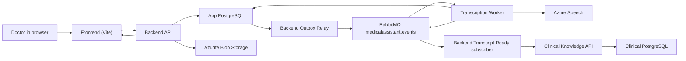

# Real-User End-to-End Journey

E01 defines the product journey that all full-system alignment work must protect. The goal is not merely that containers start; the goal is that a clinician can use the browser to turn a consultation recording into usable clinical text and downstream clinical knowledge.

## Product promise under test

A doctor signs in, creates or selects a patient, uploads a real audio consultation, waits while the system processes it asynchronously, reviews the resulting Transcript, and verifies that the Transcript is accepted by Clinical Knowledge for later retrieval/search.

This is the happy path we must prove before broader failure drills matter.

## Canonical local run shape

For the first real-user E2E pass:

- the frontend runs through Vite in the browser;
- the backend API is reached through its externally exposed local URL;
- the application PostgreSQL database stores users, patients, consultations, transcripts, outbox, inbox, and cleanup state;
- Azurite stores uploaded consultation files in private local Blob containers;
- RabbitMQ routes integration events through `medicalassistant.events`;
- the standalone Transcription Worker consumes audio-uploaded events and calls real Azure Speech with user-provided credentials;
- the backend consumes Transcript Ready events and calls the Clinical Knowledge API;
- the Clinical Knowledge service persists ingestion state in its own PostgreSQL database.

The target local product flow is:

## Real-user journey and expected evidence

| Step | User/system action | Visible result | Evidence to capture |
| --- | --- | --- | --- |
| 1 | Doctor registers a new account. | Registration succeeds and user can login. | HTTP `POST /api/Auth/register` succeeds; identity roles exist; app DB has the doctor user. |
| 2 | Doctor logs in. | Browser reaches authenticated app routes. | HTTP `POST /api/Auth/login` returns JWT; frontend stores session; `GET /api/Auth/session` succeeds. |
| 3 | Doctor creates or selects a patient. | Patient appears in dashboard/patient list. | Patient API response matches frontend type expectations; app DB associates patient with the authenticated doctor. |
| 4 | Doctor creates a consultation context. | A draft consultation exists for the doctor/patient. | Consultation API returns a consultation ID; status is `Draft`; no event has been published yet. |
| 5 | Doctor uploads a short Azure Speech-compatible audio file. | Upload completes and consultation becomes uploaded/processing. | Blob exists in the `audio` container; consultation status becomes `AudioUploaded`; outbox row exists for `consultation.audio-uploaded.v1`. |
| 6 | Backend outbox relay publishes the upload event. | Work leaves the app DB and reaches RabbitMQ. | Outbox row is marked published only after broker confirm; RabbitMQ shows delivery to the worker subscriber topology. |
| 7 | Transcription Worker consumes the event. | Consultation starts transcription. | Worker inbox row exists; worker logs show safe event metadata only; no transcript/audio content appears in logs. |
| 8 | Worker calls real Azure Speech. | Audio is transcribed or returns an actionable provider failure. | Azure Speech key/region are loaded from local env; a known-good sample produces a successful Transcript; provider errors are classified without leaking response bodies. |
| 9 | Worker stores Transcript and emits Transcript Ready. | Consultation has editable clinical text. | Transcript row exists; consultation status reaches `Transcribed` or equivalent current state; outbox/event for `consultation.transcript-ready.v1` exists. |
| 10 | Backend consumes Transcript Ready and calls Clinical Knowledge. | Transcript is accepted for downstream clinical knowledge. | Backend inbox row completes; Clinical Knowledge API accepts ingestion; app DB records ingestion/document identity. |
| 11 | Doctor refreshes consultation detail page. | Transcript is visible and stable after refresh. | Frontend displays final status and transcript text using current backend contracts; no enum/status mismatch blocks rendering. |
| 12 | Doctor verifies downstream value. | Clinical Knowledge result is retrievable or durably accepted. | Search/retrieval UI or API confirms the consultation was ingested, or the accepted ingestion ID/document ID is recorded as the current available proof. |

## Expected visible status progression

The exact UI labels may evolve, but the E2E run must explain any difference between frontend labels and backend enum values. The intended progression for an audio consultation is:

1. `Draft` — consultation exists before a file is uploaded.
2. `AudioUploaded` — audio file is stored and processing intent is durable.
3. `Transcribing` — worker has claimed or started transcription.
4. `Transcribed` — Transcript exists and is available for doctor review.
5. `StructuredDataPending` or Clinical Knowledge pending/accepted — downstream enrichment is in progress or accepted.
6. `Completed` or the current final equivalent — the consultation has usable clinical text and downstream state is reconciled.

If the current code uses a different final state, the E2E evidence must name the actual value and whether the UI treats it correctly.

## Acceptance criteria for E01

E01 is complete when:

- this document names the canonical user journey;
- every hop from browser to Clinical Knowledge has an expected evidence source;
- the intended status progression is explicit;
- real Azure Speech is part of the happy path, not a fake transcription provider;
- no step requires Azure Functions or legacy direct queues;
- no evidence instruction asks operators to copy clinical content, raw payload JSON, Blob URIs, secrets, provider response bodies, or raw exception details into notes.

## Open checks deferred to later tasks

E01 deliberately defines the journey; it does not prove the system currently runs. The following checks are handled by later tasks:

- local env and real Azure Speech secret alignment: E02;
- clean workspace/runtime cleanup: E03;
- authoritative ports/run mode: E04;
- clean Compose startup and database/storage proof: E05-E09;
- frontend/backend API and CORS alignment: E10-E14;
- live RabbitMQ, worker, Azure Speech, and Clinical Knowledge flow: E15-E20;
- browser-based user acceptance: E21-E26.

