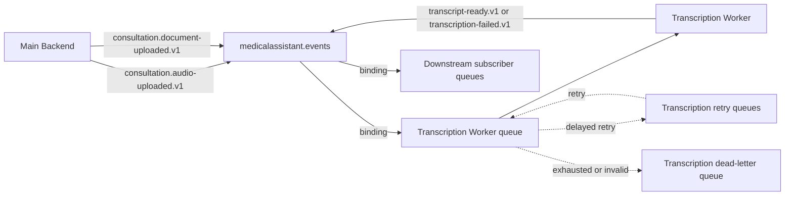

# Target Event Topology and Contracts

## Topology

All business integration events enter one durable direct exchange:

`medicalassistant.events`

Each independently deployable subscriber declares its own durable main queue, retry topology, and dead-letter queue. The Transcription Worker owns a queue bound only to `consultation.audio-uploaded.v1`. A future Document Processor owns a different queue bound to `consultation.document-uploaded.v1`. A publisher sends to a routing key and never publishes directly to either queue.

The concrete subscriber queue names are configuration, not event contracts. A recommended convention is `<service>.<purpose>.q`, with `.retry.<delay>` and `.dlq` suffixes, scoped by environment or virtual host.

## Event envelope

Every event carries the same durable envelope fields:

| Field | Purpose |
| --- | --- |
| `eventId` | Globally unique idempotency key generated once by the producer |
| `eventType` | Stable routing key, including major contract version |
| `occurredAtUtc` | UTC time when the stated business fact became true |
| `producer` | Stable logical producer name, not an instance hostname |
| `correlationId` | Connects all work for the same user-visible operation |
| `causationId` | Identifies the command or event that directly caused this event |
| `payload` | Minimum event-specific data needed by authorized subscribers |

W3C trace context is propagated in RabbitMQ headers for observability. It is not relied upon as durable business identity.

## Initial event catalog

### `consultation.audio-uploaded.v1`

Fact: an audio Consultation File is durably registered and available for Transcription.

Minimum payload:

- `consultationId`
- `fileId`
- `contentType`
- `storageObjectReference` using an opaque private reference, not a signed URL
- `durationSeconds` when known

Patient ID, doctor ID, original filename, audio bytes, and other clinical data are excluded unless a future consumer proves a necessary authorized use.

### `consultation.document-uploaded.v1`

Fact: a non-audio Consultation File is durably registered and available for Document Processing.

Minimum payload:

- `consultationId`
- `fileId`
- stable `documentType` declared by the uploader when known
- `contentType`
- `storageObjectReference` using an opaque private reference, not a signed URL

The Transcription Worker does not bind this routing key. Until a Document Processor exists, the Consultation remains visibly pending document processing; no placeholder Transcript is created.

### `consultation.transcript-ready.v1`

Fact: a stored Transcript is ready for authorized downstream processing.

Minimum payload:

- `consultationId`
- `fileId`
- `transcriptId`
- `transcriptRevision`
- `languageCode` when known

The event is emitted for the initial completed transcript and for each clinician correction, with an increasing revision. Transcript text is never carried on the bus. Authorized consumers retrieve it through their approved data boundary.

### `consultation.transcription-failed.v1`

Fact: a valid audio Consultation File reached a terminal transcription outcome.

Minimum payload:

- `consultationId`
- `fileId`
- stable `failureCode`
- user-safe `failureCategory`

The payload excludes exception text, stack traces, provider response bodies, and speech content.

### `consultation.deleted.v1`

Fact: a Consultation was deleted or made unavailable according to the product's retention policy.

Minimum payload:

- `consultationId`
- `deletedAtUtc`
- stable `reasonCode` when policy permits disclosure

Subscribers use this event to perform idempotent cleanup. A content-free backend tombstone remains authoritative so delayed events cannot recreate deleted clinical content.

## Compatibility rules

1. A routing key identifies one major semantic contract.
2. Renaming a CLR class does not rename a routing key.
3. Optional fields may be added only with tolerant-reader tests and safe defaults.
4. Removing a field, changing its meaning/type, or changing the stated fact requires a new routing-key version.
5. During migration, producers may dual-publish or an adapter may translate versions. Both versions remain observable until all subscribers migrate.
6. Contract tests serialize representative producer events and deserialize them with each supported subscriber version.

## Privacy and access

RabbitMQ connections use TLS and separate least-privilege credentials per service. Virtual-host permissions restrict which exchanges and queues a service may configure, publish to, or consume. Broker payloads, retry queues, dead-letter queues, outbox records, and backups are all treated as sensitive operational data even though event payloads are minimized.
