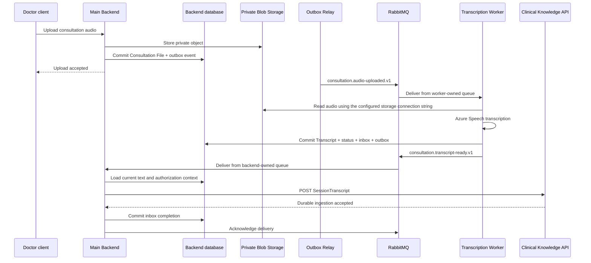

# Target Architecture and End-to-End Flow

## Outcome

The Azure Function transcriber is replaced by a standalone .NET Transcription Worker. RabbitMQ integration events connect durable state transitions without carrying audio or transcript text. The main backend remains the authorization and Clinical Knowledge integration boundary.

The diagram omits retry queues and dead-letter queues for readability. Both consumers follow ADR 0003's at-least-once/dead-letter design, but not its "five delayed retries" detail — the shipped configuration disables delayed retries entirely (empty `RabbitMQ:Topology:RetryDelays`), so a transient failure dead-letters immediately (tracked as [K07](../../docs/known-issues/refactor-baseline.md)).

## Component responsibilities

| Component | Owns | Does not own |
| --- | --- | --- |
| Main Backend | Upload authorization, consultation state, private blob registration, outbox relay, Transcript Ready consumption, Clinical Knowledge submission | Speech recognition, vector ingestion |
| RabbitMQ | Durable routing, subscriber isolation, retry/dead-letter topology | Business state, clinical-content storage, orchestration decisions |
| Transcription Worker | Audio Uploaded consumption, blob retrieval, Azure Speech, transcript persistence, processing audit, result-event publication | Non-audio documents, user-facing HTTP, Clinical Knowledge ingestion |
| Clinical Knowledge API | Durable document ingestion, chunking, embeddings, retrieval data, ingestion status | Audio retrieval, speech-to-text, user authorization |
| Blob Storage | Private consultation files | Event delivery or workflow state |
| Backend database | Consultation/transcript state, inbox/outbox records, audit metadata | Audio bytes, broker queue state |

## Project shape

The target solution should introduce broker-independent and RabbitMQ-specific modules following the useful eShop separation:

- `MedicalAssistant.EventBus`: integration-event envelope, event-name mapping, `IEventBus`, typed handler and subscription abstractions.
- `MedicalAssistant.EventBusRabbitMQ`: RabbitMQ connection, exchange/queue declarations, publisher confirms, dispatch, retry/dead-letter behavior, and trace propagation.
- `MedicalAssistant.Transcription.Worker`: a normal .NET Worker host with the Audio Uploaded handler and transcription application code.
- Main-backend outbox/inbox persistence and hosted relay/consumer registrations.
- Shared event-contract assemblies only where coordinated release/versioning is acceptable; consumers must still test serialized wire compatibility.

No project references Azure Functions packages, uses `[RabbitMQTrigger]`, or requires a Functions host.

## State and acknowledgement boundaries

For Audio Uploaded, the worker commits the inbox result, Transcript, consultation status, processing audit, and outgoing result event in one database transaction. Only then does it acknowledge RabbitMQ. The outbox relay publishes the result separately with confirms.

For Transcript Ready, the backend treats the Clinical Knowledge API's durable `202 Accepted` response and returned ingestion identity as the external handoff. It then commits that identity with its inbox completion before acknowledging. Reconciliation can query the ingestion API if a crash occurs between external acceptance and the local commit.

## Clinician corrections

Editing a Transcript creates a new revision and an outbox `consultation.transcript-ready.v1` event. The backend consumer submits the new content using the same stable Clinical Knowledge document identity. The ingestion service's correction semantics supersede the prior version rather than creating unrelated duplicate knowledge.
