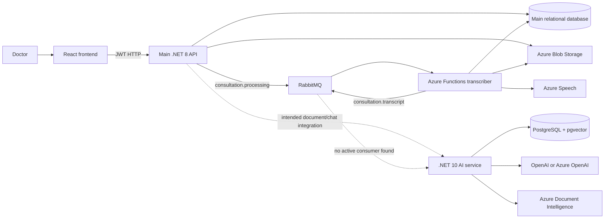

# System Architecture

> Superseded architecture snapshot. It describes the removed Azure Function transcription topology and predates the root Compose manifest. Use the [canonical system map](../../docs/architecture/system-map.md).

## Architectural shape

The repository is a monorepo containing four applications and one infrastructure package:

- A React browser application.
- A .NET 8 main API split into Clean Architecture projects.
- A .NET 8 isolated Azure Functions transcriber.
- A .NET 10 AI ingestion/retrieval API.
- A Dockerized RabbitMQ broker.

The main application and transcriber share one operational database model. The AI service owns a separate PostgreSQL/pgvector model.

## Logical architecture

Solid arrows represent connected code paths. Dotted arrows represent intended or incomplete integration.

## Boundary responsibilities

### Frontend boundary

The frontend owns presentation, navigation, client-side form validation, media capture, polling, confirmation dialogs, and local UI/session state. It does not access databases, queues, Blob Storage, or the AI service directly.

### Main backend boundary

The main backend is the application gateway and the current authority for doctor identity and access to patients/consultations. It owns the core workflow data and mediates file storage, messaging, and AI calls.

### Transcriber boundary

The transcriber is an asynchronous worker, not a public API. It receives a consultation/file identity, retrieves the blob, creates or updates the transcript, advances consultation status, writes audits, and publishes a transcript-ready event.

### Clinical Knowledge boundary

The AI service treats the main backend as its one trusted caller. It owns document ingestion state, raw ingestion payloads, derived chunks and embeddings, summaries, analyte rows, retrieval, and grounded-answer policy. It deliberately does not own users, frontend authorization, or stored conversations.

## Communication patterns

| Interaction | Pattern | Reliability behavior |
| --- | --- | --- |
| Frontend → main backend | Synchronous HTTPS/JSON or multipart | Errors returned to UI; 401 logs the browser out |
| Backend → Blob Storage | Synchronous SDK upload/download | API command fails if storage fails |
| Backend → RabbitMQ | Best-effort publish | Upload succeeds even if publish fails; no transactional outbox |
| RabbitMQ → transcriber | At-least-once trigger | Failure throws and leaves message retryable; duplicate transcription is detected |
| Transcriber → main database | Direct EF Core writes | Transcript is idempotent per consultation |
| Transcriber → transcript queue | Required before inbound acknowledgement | Redelivery republishes when transcript already exists |
| Backend → legacy AI module | Synchronous HTTP with API key | Several operations are best-effort; endpoint contract is obsolete |
| Backend → new AI service | Intended HTTP with shared secret | Adapter/client work is missing |
| AI API → AI worker | Durable DB record then in-process channel | Recovery sweep re-enqueues abandoned work |
| AI service → pgvector | EF Core + direct vector SQL | Final document visibility is transactionally atomic |

## Data stores

### Main relational database

Holds patients, consultations, transcripts, structured medical data, doctor notes, action requests, audit logs, error logs, and ASP.NET Identity data. PostgreSQL is the configured default; SQL Server is supported by the data/identity registration code.

### Blob Storage

Holds consultation audio and PDF files. The relational database stores blob URIs and metadata rather than file bytes.

### AI PostgreSQL/pgvector database

Holds ingestion records and raw payloads, chunks and embeddings, document and patient summaries, verified analyte rows, agent instructions, quality reports, and erasure logs. It is both the relational system of record for the AI service and its vector store.

### RabbitMQ

Decouples upload requests from transcription. It also provides the planned transcript-ready boundary for downstream LLM/document processing.

## Deployment units

Each top-level application is independently buildable and deployable. There is no root deployment manifest that provisions or starts the whole system. In production, operators must coordinate compatible configuration across at least the frontend, main backend, RabbitMQ, Blob Storage, the transcriber, the main database, the AI service, the AI database, and external Azure/OpenAI providers.

## Architectural strengths

- Clear separation between clinician workflow, transcription, and clinical knowledge.
- Patient and doctor checks in main backend queries/commands.
- Asynchronous processing for long-running transcription and ingestion.
- Explicit domain state models rather than opaque background jobs.
- Atomic AI ingestion and correction in one authoritative store.
- Provider abstractions around speech, document extraction, chat, and embeddings.
- Safety-oriented source preservation and evidence packaging.

## Architectural pressure points

- Two incompatible AI contracts coexist.
- RabbitMQ publishing from the backend is best-effort without an outbox, so a successful upload can remain permanently unprocessed.
- The transcriber directly shares the main database schema, coupling deployments and migrations.
- Frontend polling is the only connected status delivery for the main workflow; the AI SignalR hub is not relayed.
- There is no root orchestration, environment contract, or deployment topology in the repository.

