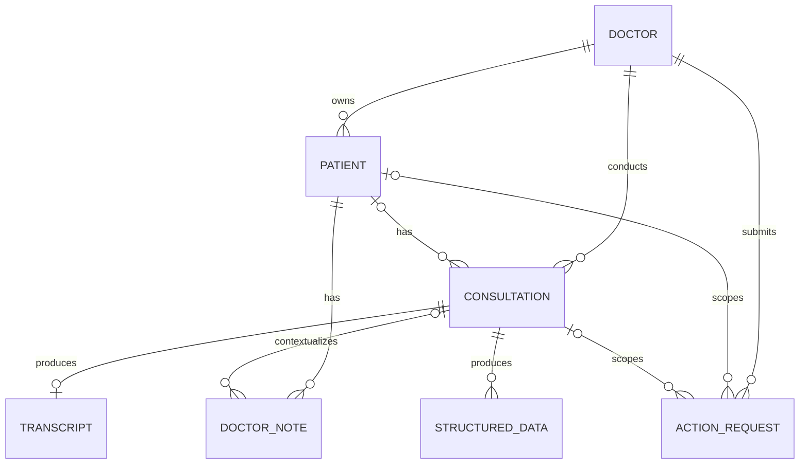
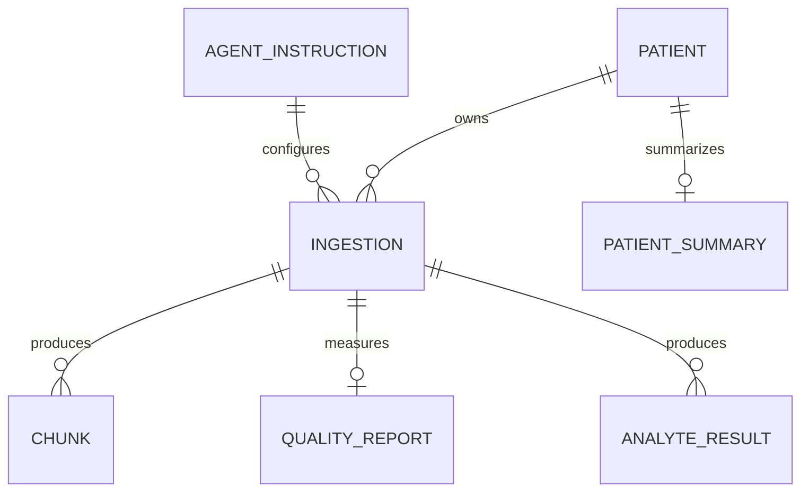

# Domain and Data Model

> Historical domain snapshot. Use the [context maps](../../docs/contexts/) (Care Workflow, Clinical Knowledge, Consultation Processing) and the [canonical system map](../../docs/architecture/system-map.md) for current terms and data placement.

The system has two related models. The main backend models the doctor's workflow; the AI service models clinical documents and derived knowledge. Canonical terms are in the [Context Map](CONTEXT-MAP.md).

## Care Workflow model



### Patient

Stores name, optional external patient ID and date of birth, assigned doctor, and optional longitudinal summary. External patient ID is unique within one doctor's patients when present.

### Consultation

Stores optional patient, owning doctor, clinical date, workflow status, Blob Storage references for audio/PDF, duration, idempotency key, and failure reason. A consultation may be created unassigned. The `(doctor, idempotency key)` pair is unique when provided.

Consultation states:

```text
Draft
  -> AudioUploaded | DocumentUploaded
  -> Transcribing
  -> Transcribed
  -> StructuredDataPending
  -> Completed

Any processing stage may become Failed.
```

The code does not enforce this as one centralized state machine; entity methods and handlers implement allowed transitions.

### Transcript

One transcript per consultation, enforced by a unique database index. It holds pending/processing/completed/failed state, editable text, optional external job ID, processing time, and failure reason.

### Structured Medical Data

A versioned JSON payload derived for a consultation, optionally linked to a transcript. It has extraction time and an approval flag. Multiple records can exist for one consultation; queries select the latest.

### Doctor Note

Doctor-owned free text attached to a patient and optionally to a consultation. Notes are source clinical material, not generated summaries.

### Action Request

Tracks an external AI action using a unique correlation ID, action type, scope, request/response JSON, job ID, state, and failure reason.

### Audit and error logs

Audit logs capture actor/action/entity/detail fields. Error logs capture message, stack, HTTP path/method, and timestamp. The transcriber writes detailed stage audits directly to the shared audit table.

## Clinical Knowledge model



### Ingestion Record

The durable lifecycle record for one document-processing attempt. It includes external document/doctor/patient identity, declared type, content hash, status, attempts, raw JSON payload, generated document summary, model/prompt provenance, lab extraction flag, deletion actor/time, and timestamps.

Important states are `Queued`, `Processing`, `Completed`, `Failed`, `Superseded`, and `Deleted`.

### Chunk

One retrievable unit containing source identity and scope, clinical date, language, chunk kind, source reference, verbatim text, optional model-written context blurb, embedding, and embedding-model name.

Summary chunks are model-written; other stored source text is intended to remain verbatim. The `VerbatimText` property name therefore requires interpretation together with `ChunkKind`.

### Analyte Result

A relational laboratory measurement stored beside vector chunks. The model assigns the canonical name and points at cells; code copies the printed name, value, unit, reference range, and flag. Rows are stored all-or-nothing for a report.

### Document and patient summaries

An ingestion may store a per-document summary. A separate one-row-per-patient summary is regenerated from current document summaries. The patient summary is best-effort and can lag if regeneration fails.

### Quality Report

One report per completed ingestion. It records chunk count, token distribution, guardrail merges/splits, and whether corrective chunking retry occurred. It is committed with the chunks it describes.

### Agent Instruction

Named prompt text and version stored in the database and loaded at startup. Migrations seed reviewed initial instructions. Runtime database edits take effect after restart and are not automatically written back to source control.

### Erasure Log

Records that administrative patient erasure occurred, who performed it, when, and counts removed. It survives deletion of the patient's other AI records.

## Data ownership and duplication

| Data | Authoritative owner |
| --- | --- |
| Doctor identity and roles | Main Identity database |
| Patient demographics | Main database |
| Consultation workflow state | Main database |
| Original consultation audio/PDF | Blob Storage, referenced by main database |
| Produced/edited transcript | Main database |
| Doctor notes | Main database |
| Approved structured consultation JSON | Main database |
| AI ingestion payload and lifecycle | AI database |
| Search chunks/embeddings | AI database |
| AI document/patient summaries | AI database |
| AI analyte rows | AI database |
| Conversation state | Intended to be main backend; not currently persisted |

The same clinical content may therefore exist in the main database, the AI ingestion payload, chunk text, summaries, and provider requests. Retention, backup, correction, and erasure procedures must account for every copy.

## Identifier translation

The main workflow uses integer patient/consultation IDs and string Identity user IDs. The AI boundary uses string patient, doctor, session, note, and report IDs. An integration adapter must define stable formatting and document identity rules rather than relying on incidental `ToString()` behavior.

