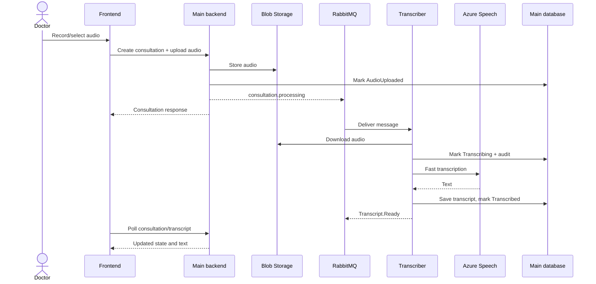
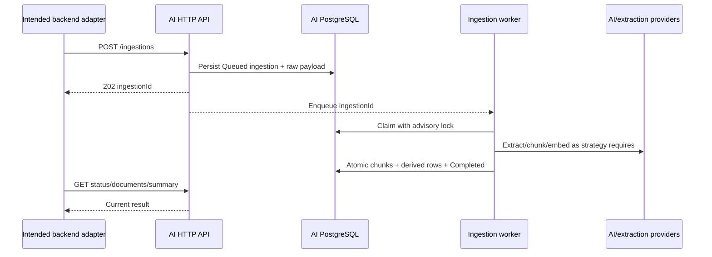
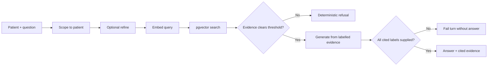

# Interfaces and Processing Workflows

> Historical interface snapshot. Use the [observable interface baseline](../../docs/architecture/observable-interface-baseline.md) for the current HTTP/SignalR contract. The sequence diagrams and "Contract adapter required" section below predate the current Transcription Worker/outbox event architecture and the completed Clinical Knowledge integration — they describe an Azure Functions transcriber and an unintegrated AI service that no longer match the system; see [messaging-and-recovery.md](../../docs/runbooks/messaging-and-recovery.md) for the current event flow.

## Main backend HTTP API

All routes are under `/api`. Except login, registration, and callback routes, controllers require a valid doctor JWT.

### Authentication

| Method | Route | Purpose |
| --- | --- | --- |
| POST | `/auth/login` | Exchange username/password for JWT and profile |
| POST | `/auth/register` | Register a doctor account |
| GET | `/auth/session` | Return current profile |
| PUT | `/auth/profile` | Update name and email |
| PUT | `/auth/password` | Change password |

### Patients and history

| Method | Route | Purpose |
| --- | --- | --- |
| GET | `/patient` | List the current doctor's patients with consultation statistics |
| GET | `/patient/{id}` | Get a doctor-owned patient |
| GET | `/patient/{id}/history` | Paginated/filterable consultations plus notes and optional structured data |
| POST | `/patient` | Create patient |
| PUT | `/patient` | Update patient |

### Consultations and files

| Method | Route | Purpose |
| --- | --- | --- |
| GET | `/consultation/drafts` | Group draft consultations by patient |
| GET | `/consultation/drafts/unattached` | List unassigned drafts |
| GET | `/consultation/analytics` | Dashboard KPIs, states, and 14-day volume |
| GET | `/consultation/patient/{patientId}` | List consultations for patient |
| GET | `/consultation/{id}` | Consultation details |
| POST | `/consultation` | Create draft; accepts `Idempotency-Key` |
| PUT | `/consultation/{id}/patient` | Attach an unassigned consultation to a patient |
| DELETE | `/consultation/{id}` | Delete consultation subject to handler rules |
| POST | `/consultation/{id}/audio` | Validate/store audio and queue processing |
| POST | `/consultation/{id}/document` | Validate/store PDF and queue processing |
| GET | `/consultation/{id}/audio` | Stream stored audio |
| GET | `/consultation/{id}/document` | Download stored PDF |
| GET | `/consultation/{id}/structured-data` | Get latest structured payload |
| POST | `/consultation/{id}/structured-data/approve` | Approve payload and complete consultation |

Configured upload limits default to 100 MiB for audio and PDF. Allowed audio types are WAV, MPEG/MP3, WebM, and Ogg; documents are PDF.

### Transcripts, notes, chat, and actions

| Method | Route | Purpose |
| --- | --- | --- |
| GET | `/transcript/{consultationId}` | Get transcript |
| PUT | `/transcript/{consultationId}` | Edit transcript and republish ready event |
| GET | `/doctorNotes/consultations/{consultationId}` | Notes for consultation |
| GET | `/doctorNotes/patients/{patientId}` | Patient-level notes |
| POST | `/doctorNotes` | Create patient- or consultation-level note |
| POST | `/chat/query` | Send general, patient, or consultation chat to legacy AI client |
| POST | `/action/trigger` | Submit confirmed legacy AI action |
| GET | `/action/{correlationId}` | Poll action state |

### Legacy callbacks

`POST /ai-callback/transcription`, `/structured-data`, and `/action` authenticate with `X-Api-Key`. They update transcript, consultation, structured data, and action state. These callbacks belong to the older AI contract, not the new AI service.

## New AI service HTTP API

All endpoints use `X-Api-Key` through a fallback authentication policy. Patient erasure additionally requires the admin key.

| Method | Route | Purpose |
| --- | --- | --- |
| POST | `/ingestions` | Submit a typed clinical document; returns 202 or duplicate/conflict outcome |
| GET | `/ingestions` | List/filter ingestions, including active backfill |
| GET | `/ingestions/{id}` | Get ingestion status |
| GET | `/ingestions/{id}/quality` | Get completed ingestion's chunk-quality report |
| POST | `/ingestions/{id}/retry` | Retry a failed ingestion from stored payload |
| GET | `/patients/{patientId}/documents` | List the patient's current documents, optionally by doctor |
| GET | `/patients/{patientId}/summary` | Get rolling patient summary |
| DELETE | `/documents/{documentId}` | Un-ingest a document; requires `removedBy` query value |
| DELETE | `/patients/{patientId}/data` | Erase all patient AI data; requires admin key and `erasedBy` |
| POST | `/patients/{patientId}/chat/answer` | Return grounded answer or insufficient-evidence refusal |
| SignalR | `/hubs/ingestion-status` | Authenticated ingestion status events |

The ingestion body varies by `documentType`:

- `SessionTranscript`: doctor/patient/session IDs, sequence number, date, language, and transcript text.
- `DoctorNote`: doctor/patient/note IDs, optional session, date, language, and text.
- `LabReport`: doctor/patient/report IDs, date, language, and base64 PDF.
- `ImagingReport`: lab-like fields plus image link.

## Queue contracts

### `consultation.processing`

Published by the main backend and consumed by the transcriber. The JSON carries event type, consultation/patient/doctor IDs, consultation status, file type, blob URI, content type/name, duration, correlation ID, and event time.

The backend publisher declares a durable queue and persistent messages. A publish failure is logged but does not roll back upload/database state.

### `consultation.transcript`

Published by the transcriber after completion or duplicate redelivery, and by the backend after manual transcript editing. The payload carries `Transcript.Ready`, transcript ID, consultation ID, correlation ID, and timestamp.

No active consumer was found. The new AI service accepts transcript ingestion through HTTP and does not consume RabbitMQ.

## Workflow: audio consultation

## Workflow: AI document ingestion

## Workflow: grounded answer

## Contract adapter required

The main backend expects `/v1/transcribe`, `/v1/extract`, `/v1/index/documents`, `/v1/chat`, and `/v1/actions`. The new AI service exposes the table above. Integration therefore requires an explicit adapter/client rewrite, including:

- Mapping main patient/doctor/consultation/transcript/note IDs to AI string identities.
- Mapping transcript and note content to typed ingestion requests.
- Deciding how/when PDFs are sent to the AI service.
- Relaying status/SignalR events or polling them.
- Replacing chat DTOs and rendering structured citations.
- Propagating corrections, un-ingestion, and patient erasure.
- Owning conversation storage if multi-turn chat is required.

